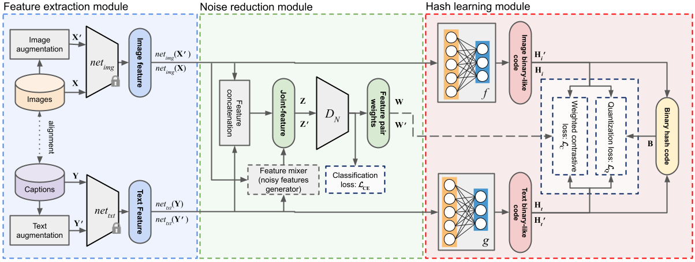

# Unsupervised Caption Noise Robust Cross-Modal Retrieval in Remote Sensing

> Paper placeholder

If you use the code from this repository in your research, please cite the following paper:

```
Bibtex placeholder
```

---

## Structure



---

## Requirements

* Python 3.8
* PyTorch 1.8
* Transformers 4.4

Libraries installation:
```
pip install -r requirements.txt
```

---

## Data

[Augmented and non-augmented image and caption features](https://tubcloud.tu-berlin.de/s/DykEC54PxRM93TP) for UCMerced and RSICD datasets encoded with ResNet18 and BERT respectively. Insert them to `./data/` folder.


---

## Configs

`./configs/base_config.py`

Base configuration class (inherited by other configs):
* CUDA device
* seed
* data and dataset paths

`./configs/config.py`

DUCH-NR learning configuration:
* learning perparameters

---

## Learning

```
main.py [-h] [--test] [--bit BIT] [--model MODEL] [--epochs EPOCHS]
               [--tag TAG] [--dataset DATASET] [--preset PRESET]
               [--alpha ALPHA] [--beta BETA] [--gamma GAMMA]
               [--contrastive-weights CONTRASTIVE_WEIGHTS CONTRASTIVE_WEIGHTS CONTRASTIVE_WEIGHTS]
               [--img-aug-emb IMG_AUG_EMB] [--txt-aug-emb TXT_AUG_EMB]
               [--noise-wrong-caption NOISE_WRONG_CAPTION]
               [--clean-captions CLEAN_CAPTIONS]
               [--noise-weights {normal,exp,dis,ones}]
               [--clean-epochs CLEAN_EPOCHS]

optional arguments:
  -h, --help            show this help message and exit
  --test                train or test
  --bit BIT             hash bit
  --model MODEL         model type
  --epochs EPOCHS       training epochs
  --tag TAG             model tag
  --dataset DATASET     ucm or rsicd
  --preset PRESET       data presets, see available in config.py
  --alpha ALPHA         alpha hyperparameter (La)
  --beta BETA           beta hyperparameter (Lq)
  --gamma GAMMA         gamma hyperparameter (Lbb)
  --contrastive-weights CONTRASTIVE_WEIGHTS CONTRASTIVE_WEIGHTS CONTRASTIVE_WEIGHTS
                        contrastive loss component weights: [inter, intra_img,
                        intra_txt]
  --img-aug-emb IMG_AUG_EMB
                        overrides augmented image embeddings file (u-curve)
  --txt-aug-emb TXT_AUG_EMB
                        overrides augmented text embeddings file (noise)
  --noise-wrong-caption NOISE_WRONG_CAPTION
                        probability of 'wrong caption' noise
  --clean-captions CLEAN_CAPTIONS
                        size of the clean dataset for meta-training captions
                        in dataset
  --noise-weights {normal,exp,dis,ones}
                        sample weight types: normal, exponential, discrete or
                        1
  --clean-epochs CLEAN_EPOCHS
                        number of meta-training epochs
```

Examples:

1. Train model for 64 bits hash codes retrieval on UCM data. Clean dataset for meta-training is 30% of training data. 20% of noise will be injected in training data. Use discrete joint-feature weights
```
main.py --dataset ucm --bit 64 --tag my_model --noise-wrong-caption 0.5 --clean-captions 0.3 --noise-weights dis
```

2. Train model for 64 bits hash codes retrieval on UCM data. Clean dataset for meta-training is 20% of training data. 20% of noise will be injected in training data. Use normal joint-feature weights
```
main.py --dataset ucm --bit 64 --tag my_model --noise-wrong-caption 0.2 --clean-captions 0.2 --noise-weights normal
```

---

## License

The code is available under the terms of MIT license:

```
Copyright (c) 2021 Georgii Mikriukov

Permission is hereby granted, free of charge, to any person obtaining a copy
of this software and associated documentation files (the "Software"), to deal
in the Software without restriction, including without limitation the rights
to use, copy, modify, merge, publish, distribute, sublicense, and/or sell
copies of the Software, and to permit persons to whom the Software is
furnished to do so, subject to the following conditions:

The above copyright notice and this permission notice shall be included in all
copies or substantial portions of the Software.

THE SOFTWARE IS PROVIDED "AS IS", WITHOUT WARRANTY OF ANY KIND, EXPRESS OR
IMPLIED, INCLUDING BUT NOT LIMITED TO THE WARRANTIES OF MERCHANTABILITY,
FITNESS FOR A PARTICULAR PURPOSE AND NONINFRINGEMENT. IN NO EVENT SHALL THE
AUTHORS OR COPYRIGHT HOLDERS BE LIABLE FOR ANY CLAIM, DAMAGES OR OTHER
LIABILITY, WHETHER IN AN ACTION OF CONTRACT, TORT OR OTHERWISE, ARISING FROM,
OUT OF OR IN CONNECTION WITH THE SOFTWARE OR THE USE OR OTHER DEALINGS IN THE
SOFTWARE.
```